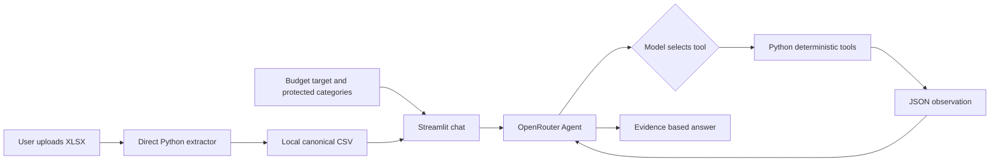

# Personal Finance Statement Agent

Personal Finance Statement Agent is a PE6201 course project that turns an uploaded payment statement into a transparent, conversational budgeting workflow. A user uploads a WeChat Pay XLSX file, reviews the extracted local CSV and budget categories, sets a spending limit and protected categories, then asks questions in a Streamlit chat.

The application combines deterministic Python calculations with an OpenRouter-powered Agent. Python performs transaction filtering, aggregation, budget checks, and savings-plan calculations; the Agent selects bounded read-only tools, reviews their observations, and explains the result. This keeps financial figures traceable while supporting multi-step questions such as diagnosing overspending and creating a protected-category savings plan.

The project deliberately avoids bank integration, arbitrary SQL, and automatic financial decisions. Statements remain local CSV files, users can review categories before analysis, and the Agent cannot modify statement data.

## Product documentation

**Persona.** The primary persona is a student or early-career adult who has an exported payment statement but does not want to manually analyse every transaction in a spreadsheet. They need a private, understandable way to identify overspending and explore a constrained monthly saving goal.

**Inputs.** The user provides an XLSX payment statement, a billing month, a maximum monthly spending limit, a saving target, and categories to protect from reduction suggestions.

**Outputs.** The app produces an extracted local CSV, a deterministic monthly summary and budget status, an Agent response with evidence-based spending analysis, a bounded tool-call trace, and an optional protected-category saving plan.

## Architecture



The model never directly edits the CSV. It selects tool names and arguments; Python executes bounded local functions and returns observations to the model. The current loop requires at least two tool observations before finalising an answer, while the model decides which complementary tools to use.

## Workflow

```text
User uploads XLSX statement
  -> Direct extractor creates a local CSV
  -> User sets budget, saving target, and protected categories
  -> User asks a finance question
  -> Agent selects a suitable read-only tool
  -> Python executes the tool on the local CSV and returns an observation
  -> Agent reviews the observation and selects a second complementary tool
  -> Final evidence-based answer and savings recommendation
```

## Inputs

1. An `.xlsx` statement. Its first worksheet needs `Date` and `Amount` columns. `Merchant`, `Description`, and `Category` are optional.
2. Your maximum monthly spending in SGD.
3. Your saving target in SGD.
4. The budget categories you want to keep. The saving tool will exclude these categories and analyse all other spending for possible reductions.

The extraction tool normalises the worksheet into `Date, Merchant, Description, Amount, Category` and saves it under `data/statements/`. A single-month statement becomes `YYYY-MM.csv`; a multi-month statement becomes `YYYY-MM_to_YYYY-MM.csv`.

WeChat Pay XLSX exports are supported: the extractor finds their Chinese transaction header after the introductory rows, maps `交易时间`, `交易对方`, `商品`, `收/支`, and `金额(元)`, and retains only `支出` rows. It suggests one of seven English budgeting categories: `Living`, `Food and Dining`, `Transport`, `Entertainment`, `Shopping`, `Lifestyle and Social`, or `Other`. Review and correct the suggestions in the UI before analysis.

## Data import

`extract_xlsx_statement` is a direct Streamlit data operation, not an agent or analysis tool. It runs only when a user uploads an XLSX file and clicks **Extract XLSX to CSV**.

## Agent analysis tools

- `query_transactions`: a bounded, read-only query over the selected month. The agent can filter by category or merchant text and group the result by transaction, category, merchant, or date.
- `get_spending_insights`: deterministic total, category shares, largest transactions, and monthly budget status.
- `create_saving_plan`: deterministic reductions for the saving target, excluding categories you marked to keep.

This is deliberately a composable data-agent design: the model decides which tool to call and can make several bounded queries before answering. It cannot supply arbitrary SQL, write to a statement, access another month, or request more than 20 items from one query.

All arithmetic is deterministic Python. Streamlit invokes the extraction tool after an upload and runs the multi-tool analysis workflow after you provide the three finance inputs. This avoids using an LLM to parse or alter a financial statement.

## OpenRouter agent

To use a real agent, copy `.env.example` to `.env`, set `OPENROUTER_API_KEY`, restart Streamlit, and use the chat at the bottom of the page. The model decides which local analysis tool is useful, Python executes it against the extracted CSV, and the model writes the final explanation. The XLSX import function is never exposed as an agent tool.

```powershell
Copy-Item .env.example .env
# Edit .env and set OPENROUTER_API_KEY
```

## Run

```powershell
cd C:\Users\ROG\personal-finance-agent
python -m venv .venv
.\.venv\Scripts\Activate.ps1
python -m pip install -r requirements.txt
streamlit run app.py
```

## Data and evaluation

The version-controlled public dataset is [`data/demo_statement.xlsx`](data/demo_statement.xlsx). It is synthetic and safe to upload for a demo. See [`data/README.md`](data/README.md) for its fields, expected totals, and privacy treatment. Real statements belong only in `data/statements/`, which is ignored by Git.

Run deterministic offline evaluation without an API key:

```powershell
python eval.py --mode offline
```

Run optional live Agent tool-coverage evaluation after configuring OpenRouter:

```powershell
python eval.py --mode live
```

The checked-in cases, definitions, and baseline result are in [`evals/`](evals/). The live evaluation is intentionally opt-in because model calls incur cost and can vary by model.

## Metrics

| Metric | Target | Reached | Evidence |
| --- | ---: | ---: | --- |
| Deterministic offline case pass rate | 100% | 4/4 (100%) | `python eval.py --mode offline` |
| Unit-test pass rate | 100% | 7/7 (100%) | `pytest` |
| Tool observations before a final answer | At least 2 | Enforced in code | `MINIMUM_TOOL_CALLS = 2` in `agent.py` |
| Live required-tool coverage | Report after live run | Not claimed yet | `python eval.py --mode live` |

## Repository map

- `app.py` - single-page Streamlit interface and chat state.
- `finance_tools.py` - XLSX extraction and deterministic local financial tools.
- `agent.py` - OpenRouter tool-calling loop, prompts, and tool dispatch.
- `eval.py` and `evals/` - reproducible offline checks and opt-in live tool-coverage evaluation.
- `data/` - synthetic demo statement and data documentation.
- `tests/` - unit tests for extraction, tools, Agent surface, and offline evaluation.
- `REPORT.md` - final project report and critique.
- `demo/README.md` - video recording and submission checklist.

## Test

```powershell
pytest
```

## Demo submission

Use the synthetic demo statement for recording. The video should show both your face and the application screen, be approximately 5 to 8 minutes, and demonstrate import, constraints, an Agent multi-tool trace, and a protected-category savings plan. See [`demo/README.md`](demo/README.md) for the checklist.

## Limitations

- The app treats all retained statement amounts as expenses by absolute value. Review the extracted CSV before using a statement that includes refunds, income, or transfers.
- It stores only local CSV files and does not connect to a bank.
- Recommendations are budgeting information, not professional financial advice.
