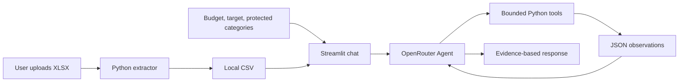

# Personal Finance Statement Agent

A PE6201 Emerging AI Technologies project that turns an uploaded payment statement into a transparent budgeting conversation. The user uploads a WeChat Pay-style XLSX file, reviews the locally extracted CSV, sets financial constraints, and asks an OpenRouter-powered Agent to investigate spending through bounded tools.

The design deliberately separates language from arithmetic: Python performs all extraction and financial calculations; the model chooses an investigation path and explains tool observations in natural language.

## Who it is for

The primary user is a student or early-career adult with an exported payment statement who wants to understand monthly spending without manually creating spreadsheet summaries. The application is a local, course-demo MVP - not a banking product or investment adviser.

## Inputs and outputs

| Input | Output |
| --- | --- |
| XLSX payment statement | Local canonical CSV with `Date`, `Merchant`, `Description`, `Amount`, and `Category` |
| Billing month and monthly spending limit | Deterministic spending summary and budget status |
| Saving target and categories to keep | Protected-category saving plan |
| Natural-language question | Evidence-based answer and inspectable tool-call trace |

Real statements remain in `data/statements/`, which is ignored by Git. The version-controlled [`data/demo_statement.xlsx`](data/demo_statement.xlsx) is synthetic and safe for demonstration.

## Architecture



The model cannot edit the statement, run arbitrary SQL, access a different month, or retrieve unlimited transactions. Python executes every tool call against the selected local CSV and returns a structured observation to the model.

## Workflow

```text
Upload XLSX
  -> Extract local CSV
  -> Set budget, saving target, and protected categories
  -> Ask a question in Streamlit chat
  -> Agent investigates with local tool observations
  -> Python performs deterministic calculations
  -> Agent explains the evidence and, when requested, a saving plan
```

The Agent normally gathers at least two observations before it can answer. For an explicit saving or reduction request, it must also call the deterministic `create_saving_plan` tool so the selected protected categories are respected.

## Tools

The XLSX extractor is a direct UI operation, not an Agent tool. The Agent has three read-only analysis tools:

- `get_spending_insights` - calculates total spending, category shares, largest transactions, and budget status for the selected month.
- `query_transactions` - performs a bounded query by category or merchant and groups results by transaction, category, merchant, or date.
- `create_saving_plan` - creates deterministic reductions for the selected saving target while excluding categories marked to keep.

## Statement import

The extractor supports WeChat Pay exports with introductory rows and Chinese transaction headers. It maps the relevant fields, retains only expense (`支出`) transactions, and suggests one of seven English budget categories: `Living`, `Food and Dining`, `Transport`, `Entertainment`, `Shopping`, `Lifestyle and Social`, and `Other`.

Users can review and correct suggested categories in the Streamlit interface before analysis. The extractor does not use an LLM and is not exposed to the Agent.

## Setup and run

```powershell
git clone https://github.com/yhh355/personal-finance-agent.git
cd personal-finance-agent
python -m venv .venv
.\.venv\Scripts\Activate.ps1
python -m pip install -r requirements.txt
streamlit run app.py
```

To enable live Agent calls, create `.env` from `.env.example` and add an OpenRouter key:

```powershell
Copy-Item .env.example .env
# Edit .env: OPENROUTER_API_KEY=your-key
```

Never commit `.env` or a real payment statement.

## Evaluation

Run the deterministic offline suite without an API key:

```powershell
python eval.py --mode offline
pytest
```

Run the optional live suite only after configuring OpenRouter:

```powershell
python eval.py --mode live
```

| Metric | Latest result | Scope |
| --- | ---: | --- |
| Offline deterministic cases | 4/4 (100%) | Extractor and financial-tool correctness on the synthetic statement |
| Unit tests | 9/9 passed | Extraction, calculations, Agent rules, and evaluation configuration |
| Live required-tool coverage | 9/10 (90%) | One 2026-10-01 run using `openai/gpt-4.1-mini` through OpenRouter |

Live coverage checks whether the required tools appeared in an Agent trace. It is not a claim of universal factual accuracy or subjective answer quality. The 10 live cases and their metric definitions are documented in [`evals/`](evals/).

## Repository map

- `app.py` - Streamlit UI, category review, initial analysis, and chat state.
- `finance_tools.py` - XLSX extraction and deterministic financial tools.
- `agent.py` - OpenRouter tool-calling loop, prompt, and safe dispatch.
- `eval.py` and `evals/` - offline evaluation and opt-in live tool-coverage evaluation.
- `data/` - synthetic demo statement and data documentation.
- `tests/` - unit tests.
- [`Personal_Finance_Agent_Final_Report.docx`](Personal_Finance_Agent_Final_Report.docx) - final project report and critique.

## Limitations

- Statements are uploaded manually; there is no bank integration.
- The current MVP analyses one selected month at a time.
- Merchant labels and transfers can be ambiguous, so user category review remains important.
- The system provides budgeting information only, not professional financial or investment advice.
